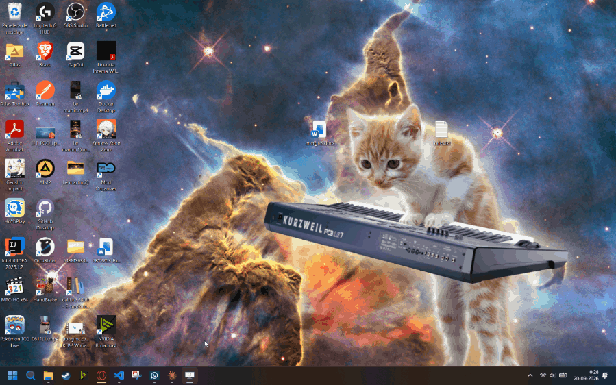
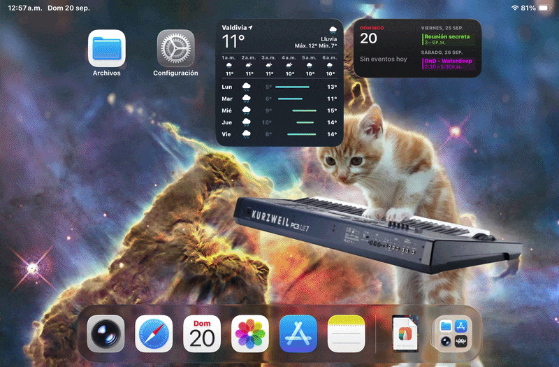
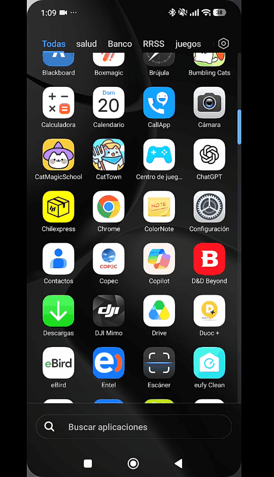
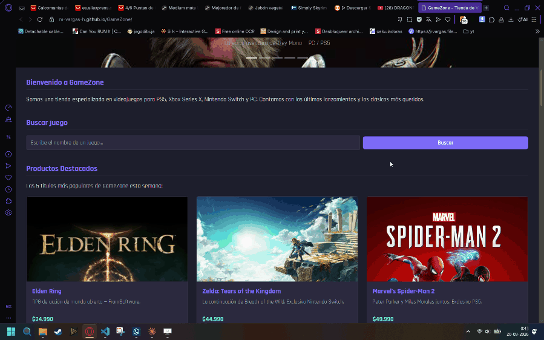
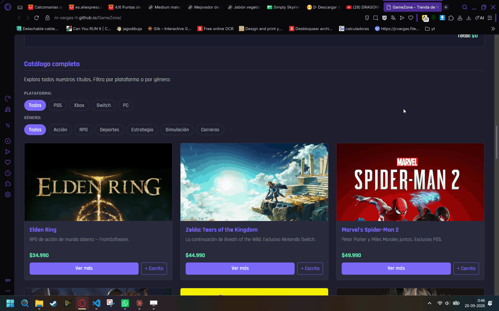
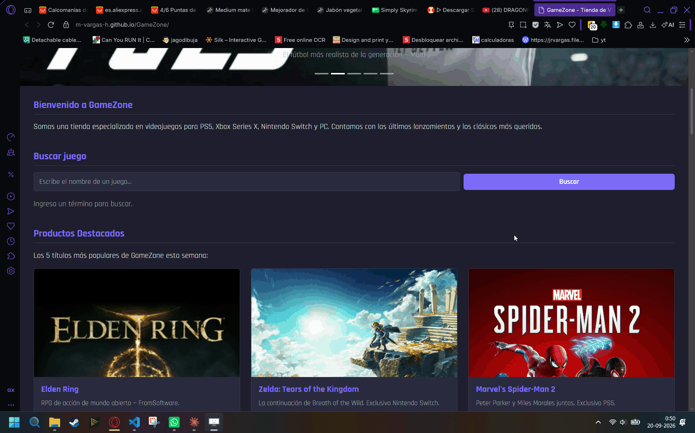
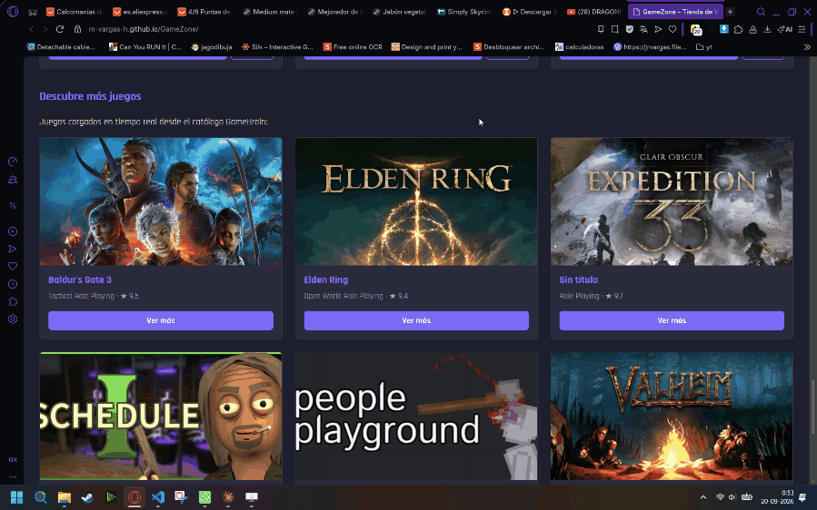

# GameZone - Tienda de Videojuegos

Sitio web responsivo desarrollado en HTML5, CSS3, Bootstrap 5 y JavaScript.

## Descripción

GameZone es una tienda de videojuegos en línea que presenta productos destacados, un catálogo completo con filtros, carrito de compras y un formulario de contacto. El sitio implementa manipulación del DOM, eventos, consumo de API externa y carga de datos desde un JSON local mediante JavaScript vanilla.

## Tecnologías utilizadas

- HTML5 semántico
- CSS3 (variables, Flexbox, media queries)
- Bootstrap 5.3.3 (navbar, carousel, grid system, cards, utilidades Flexbox)
- JavaScript (manipulación del DOM, eventos, Fetch API)
- JSON local (catálogo de productos)
- GameBrain API (carga dinámica de juegos adicionales)
- GitHub Pages (despliegue)

## Características

- Navbar responsiva con colapso en móvil (botón hamburguesa) y enlaces a secciones internas
- Carrusel de 5 imágenes con transición automática cada 3 segundos
- Sección de productos destacados: 5 títulos cargados dinámicamente desde JSON local
- Sección de catálogo completo: 15 títulos con filtros por plataforma y género (pills Bootstrap)
- Carrito de compras: agrega productos, muestra subtotal por ítem y total acumulado
- Buscador con evento `submit` que filtra por nombre o género en tiempo real
- Sección "Descubre más juegos" generada dinámicamente con Fetch API externa (GameBrain)
- Manejo de errores con mensajes amigables si el JSON o la API no cargan
- Página de contacto dedicada con formulario validado por JavaScript
- Variables CSS para paleta de colores coherente
- Accesibilidad básica con `:focus-visible` en links y botones

## Vista previa
Para las vistas previas se utilizaron diferentes dispositivos y navegadores para poder abarcar el mayor numero de escenarios posibles. Todas las evidencias se presentan en formato .gif

### Escritorio
Para la vista desde pc se utilizó el navegador Opera GX desde un pc con sistema operativo Windows 11

### Tablet
Para esta vista se utilizó en navegador Safari desde un ipad mini

### Móvil 
Para esta vista se utilizo el navegador Chrome desde un teléfono con sistema operativo Android 

## Evidencias de funcionamiento
Las evidencias de funcionamiento fueron capturadas todas desde el dispositivo utilizado para la vista de escritorio. Todas las evidencias se presentan en formato .gif

### Carrito de compras

### Filtros por plataforma y género

### Buscador

### Ver más — producto local y GameBrain

## Estructura del proyecto

## Validación

El documento HTML fue validado mediante [W3C Markup Validation Service](https://validator.w3.org/).

### Decisiones de marcado

Los títulos de las cards usan `<h3 class="h5">` para mantener coherencia visual con Bootstrap, donde la clase `h5` controla el tamaño sin afectar el nivel semántico. El validador W3C reporta un salto de nivel (h1 → h3) en la línea 87, dentro de la sección de productos. Este salto se produce porque el `<h2>` de la sección está ubicado fuera del alcance directo del validador en ese contexto. Se mantiene `<h3>` por ser el nivel jerárquico correcto dentro de cada card (subsección de un `<h2>`), aceptando la advertencia del validador como una limitación conocida.