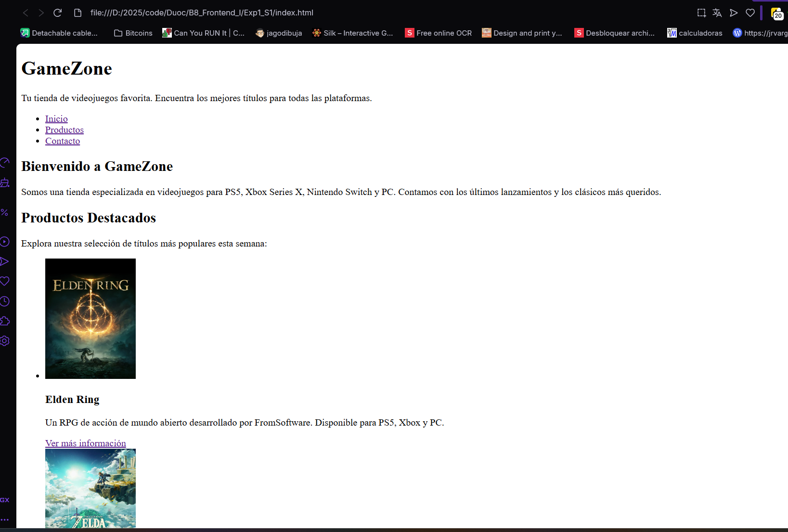
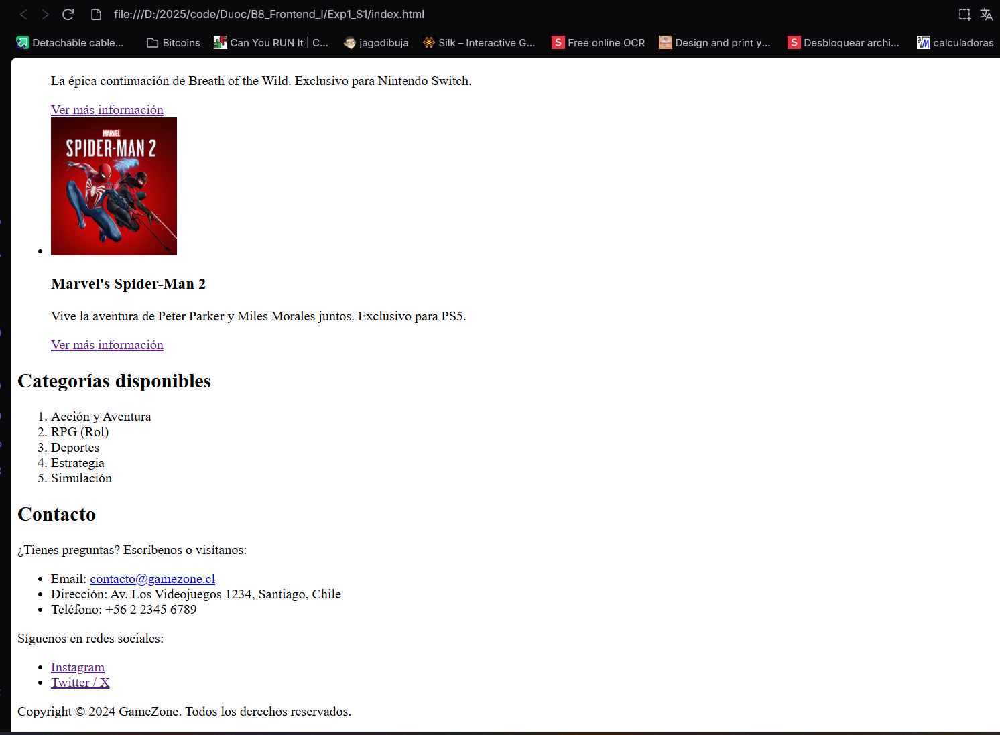

# GameZone - Tienda de Videojuegos

Sitio web estático desarrollado en HTML5 como actividad formativa.

## Descripción

GameZone es una tienda de videojuegos en línea que presenta productos destacados, categorías disponibles e información de contacto. El sitio fue construido utilizando únicamente HTML5.

## Tecnologías utilizadas

- HTML5

## Estructura del proyecto

```
GameZone
├── img
│   ├── elden-ring.jpg
│   ├── spider-man2.jpg
│   └── zelda-totk.jpg
├── screenshots
│   ├── pag1.png
│   ├── pag2.png
│   └── validacion.png
├── README.md
└── index.html
```

## Vista previa




## Validación

El documento HTML fue validado mediante [W3C Markup Validation Service](https://validator.w3.org/).

