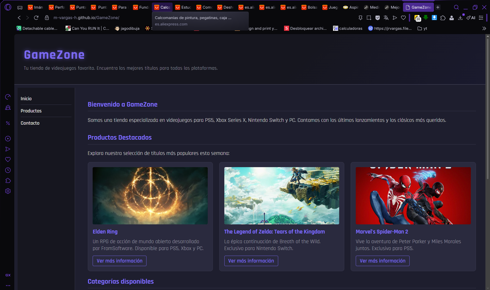
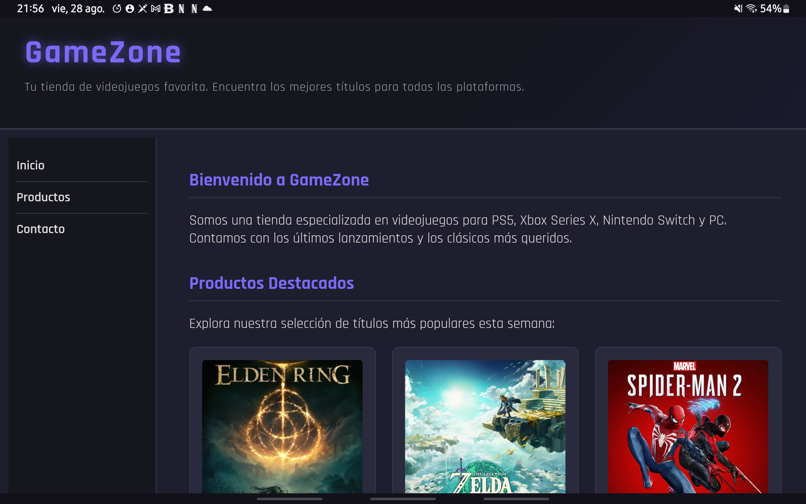
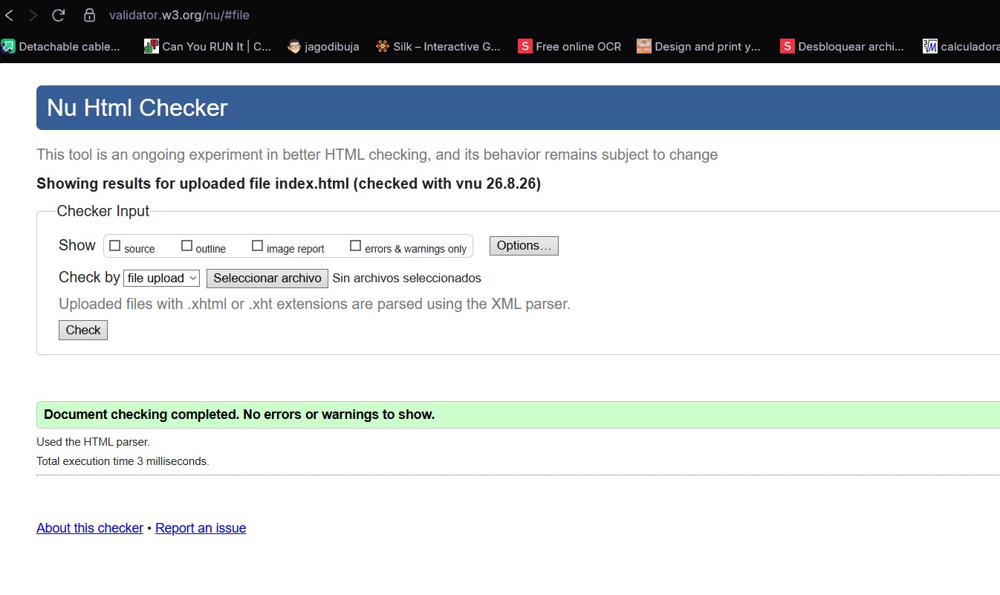

# GameZone - Tienda de Videojuegos

Sitio web estático responsivo desarrollado en HTML5 y CSS3.

## Descripción

GameZone es una tienda de videojuegos en línea que presenta productos destacados, categorías disponibles e información de contacto. El sitio implementa un diseño responsivo adaptado a escritorio, tablet y móvil mediante CSS Grid, Flexbox y media queries.

## Tecnologías utilizadas

- HTML5 semántico
- CSS3 (variables, Flexbox, Grid, media queries)
- GitHub Pages (despliegue)

## Características

- Diseño responsivo con breakpoints en 768px y 480px
- Grid de productos con 3, 2 o 1 columna según el dispositivo
- Nav lateral en escritorio que se convierte en barra horizontal en móvil
- Variables CSS para paleta de colores coherente
- Selectores por etiqueta, clase, ID y pseudo-clases (`:hover`, `:nth-child`, `:focus-visible`)
- Accesibilidad básica con `:focus-visible` en links y botones

## Vista previa

### Escritorio


### Tablet


### Móvil


## Estructura del proyecto
```
├── css
│   └── styles.css
├── img
│   ├── elden-ring.jpg
│   ├── spider-man2.jpg
│   └── zelda-totk.jpg
├── screenshots
│   ├── validacion.png
│   ├── vista_movil.png
│   ├── vista_pc.png
│   └── vista_tablet.png
├── .gitattributes
├── README.md
└── index.html
```

## Validación

El documento HTML fue validado mediante [W3C Markup Validation Service](https://validator.w3.org/).



## Sitio publicado

[https://m-vargas-h.github.io/GameZone/](https://m-vargas-h.github.io/GameZone/)