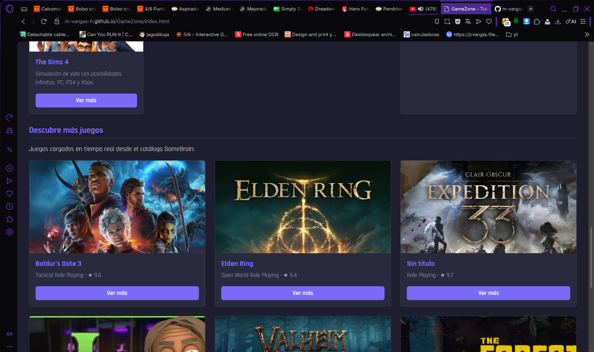
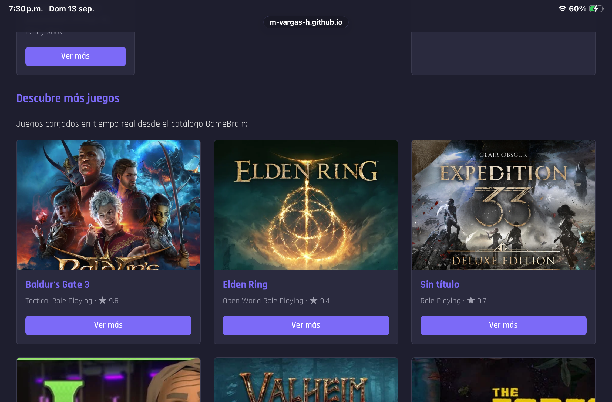

# GameZone - Tienda de Videojuegos

Sitio web responsivo desarrollado en HTML5, CSS3, Bootstrap 5 y JavaScript.

## Descripción

GameZone es una tienda de videojuegos en línea que presenta productos destacados, categorías disponibles y un formulario de contacto. El sitio implementa manipulación del DOM, eventos y consumo de API externa mediante JavaScript vanilla.

## Tecnologías utilizadas

- HTML5 semántico
- CSS3 (variables, Flexbox, media queries)
- Bootstrap 5.3.3 (navbar, carousel, grid system, cards, utilidades Flexbox)
- JavaScript ES6 (manipulación del DOM, eventos, Fetch API)
- GameBrain API (carga dinámica de juegos)
- GitHub Pages (despliegue)

## Características

- Navbar responsiva con colapso en móvil (botón hamburguesa)
- Carrusel de 5 imágenes con transición automática cada 3 segundos
- Grid de productos con 10 títulos organizados en cards Bootstrap
- Columna lateral con categorías disponibles
- Sección "Descubre más juegos" generada dinámicamente con Fetch API
- Eventos mouseover y click en cards de productos
- Página de contacto dedicada con formulario validado por JavaScript
- Variables CSS para paleta de colores coherente
- Accesibilidad básica con `:focus-visible` en links y botones

## Vista previa

### Escritorio



### Tablet



### Móvil


## Estructura del proyecto
```
├── css
│   └── styles.css
├── img
│   ├── baldurs-gate-3.jpg
│   ├── banner-baldurs-gate-3.jpg
│   ├── banner-black-myth-wukong.jpg
│   ├── banner-cities-skylines-2.jpg
│   ├── banner-ea-fc-25.jpg
│   ├── banner-nba-2k25.jpg
│   ├── black-myth-wukong.jpg
│   ├── cities-skylines-2.jpg
│   ├── cyberpunk-2077.jpg
│   ├── ea-fc-25.jpg
│   ├── elden-ring.jpg
│   ├── nba-2k25.jpg
│   ├── spider-man2.jpg
│   ├── the-sims-4.jpg
│   └── zelda-totk.jpg
├── js
│   ├── contacto.js
│   └── script.js
├── screenshots
│   ├── validacion.png
│   ├── vista_movil.jpg
│   ├── vista_movil.png
│   ├── vista_pc.png
│   └── vista_tablet.png
├── .gitattributes
├── README.md
├── contacto.html
└── index.html
```

## Validación

El documento HTML fue validado mediante [W3C Markup Validation Service](https://validator.w3.org/).


### Decisiones de marcado

Los títulos de las cards usan `<h3 class="h5">` para mantener coherencia visual con Bootstrap, donde la clase `h5` controla el tamaño sin afectar el nivel semántico. El validador W3C reporta un salto de nivel (h1 → h3) en la línea 87, dentro de la sección de productos. Este salto se produce porque el `<h2>` de la sección está ubicado fuera del alcance directo del validador en ese contexto. Se mantiene `<h3>` por ser el nivel jerárquico correcto dentro de cada card (subsección de un `<h2>`), aceptando la advertencia del validador como una limitación conocida.